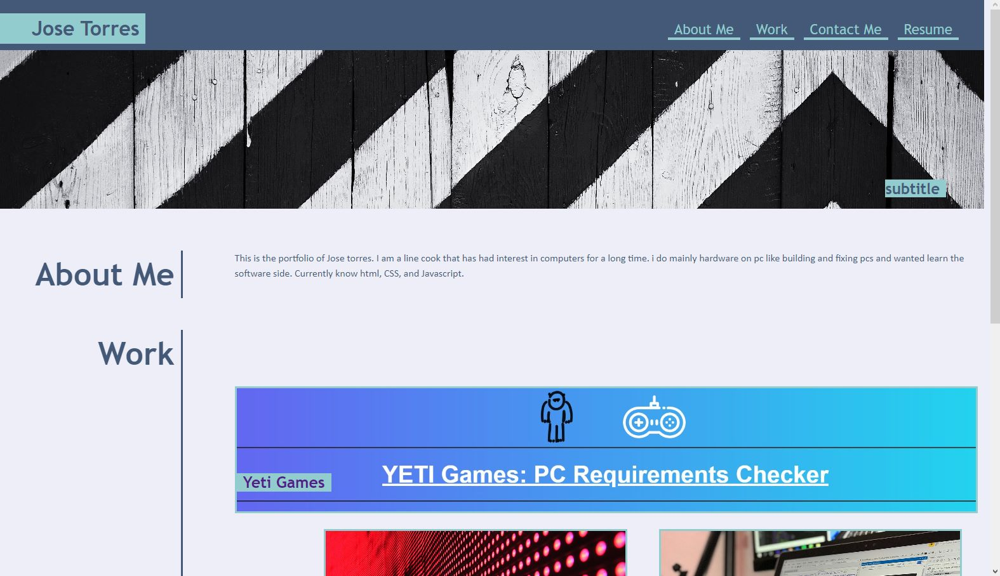

</a>
 

this is the 2nd challenge of the bootcamp, creating a portfolio.
the images and hover css was given by TA's. i started by creating the html and css sheets, i then created the header and nav using the hover. then created my hero and positioned the subtitle. Then i created the aside and h3s while adding the css to make it hang right on the page with a border on the right. After i created divs for the cards and added p tags to put a title for each card. Then i created a the contact section on the bottom and added media queries for the page. finally i cleaned the html and css by removing any unused classed and reorganizing css.